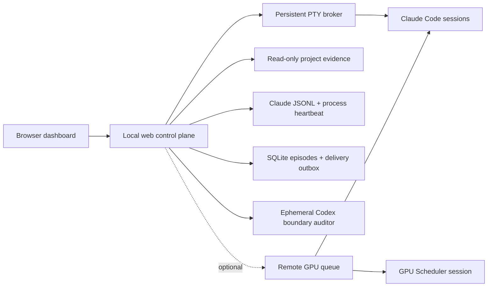

<div align="center">

# FIRM Control Room

### Keep multiple Claude Code research agents moving without losing scientific control.

[](https://github.com/Zarien-Li/firm-control-room/actions/workflows/ci.yml)
[](https://nodejs.org/)
[](https://www.apple.com/macos/)
[](LICENSE)

**One local dashboard for launching, observing, continuing, auditing, and safely re-anchoring parallel AI research sessions.**

[Quick start](#5-minute-quick-start) · [How it works](#how-it-works) · [GPU integration](#optional-gpu-queue) · [中文说明](README.zh-CN.md)

</div>

---

Opening more terminals is easy. Knowing whether nine research agents are genuinely working, waiting on a valid experiment, silently stopped, or drifting into a low-value side problem is not.

FIRM turns those hidden states into an evidence-backed control plane. It combines the Claude history stream, terminal state, process tree, project artifacts, persistent delivery acknowledgements, optional GPU queue signals, and short-lived Codex boundary audits. It can keep approved goals moving without granting a reviewer model authority over the science.

## Why FIRM

| Without a control plane | With FIRM |
|---|---|
| A prompt is visible, but you cannot tell whether Claude stopped or a tool is still draining | Explicit states such as `MODEL_WORKING`, `TOOL_RUNNING`, `WAITING_FOR_GPU`, and `WAITING_REVIEW` |
| “Continue” messages may be pasted twice or never submitted | Durable outbox, unique delivery markers, and Claude-history acknowledgement |
| A long-running session gradually replaces the original research program | Read-only evidence snapshots plus isolated Codex boundary audits |
| A reviewer agent starts inventing extra experiments and steering the PI | Codex may identify scope drift, but cannot choose methods, claims, pivots, or GPU actions |
| GPU workers start before data, dependencies, and evaluation code are ready | Optional readiness gate, queue lifecycle, phase-aware telemetry, and result wake-up |
| A session waiting for an experiment is mistaken for an abandoned session | GPU waits require an exact run ID that is independently verified as active and project-owned |

## What is automated

- **Persistent Claude sessions**: a broker owns PTYs, so a browser or web-process restart does not kill the research agent.
- **External iTerm discovery**: existing Claude Code processes are mapped to projects by verified working directory.
- **Goal Loop**: explicit per-project authorization, user-defined objectives, bounded continuation, and a rolling daily limit.
- **Immediate stop review**: a stable return to the normal Claude prompt triggers a fresh, isolated review instead of waiting for the periodic scan.
- **Research-boundary auditing**: Codex reads a bounded authority-first packet and can propose a neutral re-anchor for human approval.
- **Reliable delivery**: external messages move through `QUEUED → SENDING → SENT_AWAITING_ACK → DELIVERED`.
- **GPU-aware waiting**: a project can legitimately stop while its declared `pending/running` experiment is active; terminal results wake it again.
- **Operational honesty**: ambiguous terminals, missing observability, stale progress, permission prompts, and policy holds remain distinct states.

FIRM does **not** let the dashboard execute arbitrary shell commands. It does not let Codex decide that a method is bad, that a field is exhausted, or that a paper should pivot. It never terminates a GPU worker from utilization alone.

## 5-minute quick start

### Requirements

- macOS (external iTerm control is macOS-specific)
- Node.js 26+
- [Claude Code](https://docs.anthropic.com/en/docs/claude-code) installed and logged in
- Codex CLI installed and logged in if you want independent audits; otherwise disable them

### 1. Install

```bash
git clone https://github.com/Zarien-Li/firm-control-room.git
cd firm-control-room
npm ci
```

### 2. Create one research project

```bash
mkdir -p "$HOME/research"
cp -R examples/research-project "$HOME/research/project-alpha"
cp config/projects.example.json config/projects.json
```

Edit `config/projects.json` when your project has a different name or location. Then replace the placeholders in:

```text
~/research/project-alpha/
├── CLAUDE.md
├── CLAUDE-RESEARCH.md
├── PROGRAM_ORIGIN.md
├── PROJECT_IDENTITY.json
├── SEED.md
├── PIPELINE_STATE.md
└── prompt.txt
```

These files separate durable research authority from mutable session narration. FIRM reads only a small allowlist; it does not recursively ingest your repository.

### 3. Verify and run

```bash
npm run doctor
npm start
```

Open [http://127.0.0.1:8787](http://127.0.0.1:8787). Click **Start Claude**, or keep using an existing iTerm Claude session inside the configured project directory and let FIRM discover it.

To run without Codex audits:

```bash
FIRM_CODEX_AUDIT_ENABLED=false npm start
```

## How it works



### Evidence, not terminal guessing

FIRM derives session state from four independent signals:

1. the current terminal surface;
2. the latest main-chain Claude history event;
3. active descendant tool processes;
4. writes to a bounded set of research artifacts.

That distinction matters. A spinner with no history, artifact, or tool progress is not silently called “working.” A visible prompt while a child process drains is not silently called “stopped.”

### Safe continuation

Goal Loop is off until you explicitly enable it for a project and provide an objective. It only submits at a verified normal input prompt, never answers permission or destructive-action confirmations, respects pending interventions and high-priority events, and enforces a rolling daily continuation limit.

An external iTerm message is not considered delivered merely because AppleScript pasted it. The Claude history must contain its unique `[FIRM DELIVERY ...]` marker. Uncertain sends are exposed instead of retried blindly.

### Codex Professor Engine

Codex is invoked as a short-lived, read-only boundary auditor, not a permanent co-PI session. Each audit starts from project authority and recent bounded evidence. It may flag identity, scope, evidence, compute, or operational drift. It may not prescribe a method, add a baseline, invent a paper framing, or turn ordinary uncertainty into a stop decision.

The default re-anchor mode is `approval`: high-confidence, grounded interventions enter an inbox and wait for a human decision.

## Optional GPU queue

The local research dashboard works with GPU integration disabled, which is the public default. To connect your own SSH-accessible queue:

```bash
export FIRM_GPU_QUEUE_ENABLED=true
export FIRM_GPU_SCHEDULER_AUTO_START=true
export FIRM_GPU_QUEUE_HOST=user@gpu-control-host
export FIRM_GPU_QUEUE_SSH_PORT=22
export FIRM_GPU_QUEUE_ROOT=/absolute/remote/path/to/gpu_queue
npm start
```

The queue uses explicit file signals:

```text
pending/.submitted → running/.started → done|failed|cancelled/.ready
```

Before enabling it, adapt the operational templates in `config/` to your scheduler and place the required scheduler governance files in the projects' common parent directory. FIRM only reads queue state over a fixed SSH collector. Your scheduler remains the sole owner of worker launch and termination.

An accepted GPU wait requires both:

- the latest Claude assistant event declares `[FIRM WAITING_FOR_GPU run_id=<run_id>]`; and
- the authoritative queue independently shows the same project-owned run as `pending` or `running`.

Completed, failed, missing, cross-project, or merely planned jobs never suppress liveness review.

## Configuration

Start from [.env.example](.env.example), but export variables in your shell or process manager; FIRM does not automatically load `.env` files.

| Variable | Default | Purpose |
|---|---:|---|
| `RESEARCH_PROJECT_ROOT` | `~/research` | Root used by `${RESEARCH_PROJECT_ROOT}` in project config |
| `FIRM_CONFIG` | `config/projects.json` | Project configuration file |
| `FIRM_HOST` | `127.0.0.1` | Local bind address |
| `FIRM_PORT` | `8787` | Dashboard port |
| `FIRM_CODEX_AUDIT_ENABLED` | `true` | Enable isolated Codex audits |
| `FIRM_SCAN_INTERVAL_MS` | `9000000` | Periodic audit interval (2.5 hours) |
| `FIRM_REANCHOR_MODE` | `approval` | `off`, `approval`, or `auto` |
| `FIRM_GOAL_MAX_CONTINUES_PER_DAY` | `48` | Hard rolling 24-hour continuation limit per project |
| `FIRM_GPU_QUEUE_ENABLED` | `false` | Enable remote queue collection |
| `FIRM_GPU_SCHEDULER_AUTO_START` | `false` | Allow a configured scheduler target to start for new requests |
| `FIRM_DATA_DIR` | `./var` | Local runtime database, evidence, and transcripts |

See [src/config.js](src/config.js) for all bounded timing and executable overrides.

## Development

```bash
npm run check
npm test
npm run smoke
npm run acceptance:restart
```

The test suite covers broker/web restarts, delayed acknowledgements, interrupted sends, terminal noise, fast work cycles, collector degradation, GPU monitor loss, valid GPU waits, and duplicate-delivery prevention.

## Security model

- The server binds to localhost by default and has no multi-user authentication. Do not expose it directly to a network.
- Project collection is allowlisted and read-only; FIRM runtime data goes under `var/`.
- Web APIs select only configured projects, fixed executables, fixed arguments, and fixed working directories.
- Codex runs read-only and receives project/session text as untrusted evidence.
- Queue free text is never injected directly as a research instruction.
- The only normal Claude termination path is an explicit user stop action.
- `var/`, `work/`, local project configuration, logs, and environment files are excluded from Git.

## Status

FIRM is an early open-source release extracted from a real multi-project research workflow. It is built for local, supervised use and deliberately reports uncertain states instead of pretending to provide exactly-once control over external terminal applications.

Issues and focused pull requests are welcome.

## License

[MIT](LICENSE)
