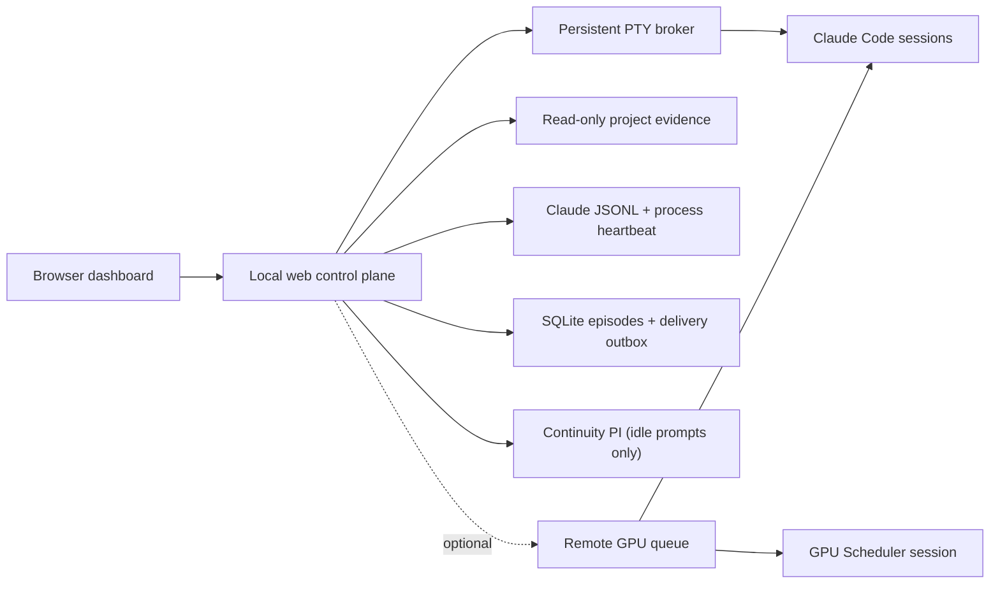

<div align="center">

# FIRM Control Room

### Keep multiple Claude Code research agents moving without losing scientific control.

[](https://github.com/Zarien-Li/firm-control-room/actions/workflows/ci.yml)
[](https://nodejs.org/)
[](https://www.apple.com/macos/)
[](LICENSE)

**One local operations plane for observing parallel research sessions and long-running jobs without becoming a second PI.**

[Quick start](#5-minute-quick-start) · [How it works](#how-it-works) · [GPU integration](#optional-gpu-queue) · [中文说明](README.zh-CN.md)

</div>

---

Opening more terminals is easy. Knowing whether nine research agents are genuinely working, waiting on a valid experiment, silently stopped, or drifting into a low-value side problem is not.

FIRM turns those hidden states into an evidence-backed control plane. It combines the Claude history stream, terminal state, process tree, project artifacts, a durable Job Registry, optional GPU queue signals, and an optional event-driven Continuity PI. The Continuity PI resumes genuinely idle research turns; it is separate from scientific portfolio review and is forbidden to invent a replacement method or change a paper's direction.

### Default authority mode

The public default is **operations-only**: `FIRM_CONTINUITY_ENABLED=false`. In this
mode FIRM may observe sessions, reconcile jobs and resources, and deliver allowlisted
operational facts, but it does not call Codex, answer stopped prompts, judge project
value, choose a research route, or review papers. An external scheduled PI/reviewer may
use FIRM's facts, but remains a separate process with its own policy and audit trail.

Enabling Continuity PI changes only the narrow stopped-prompt behavior documented
below. It does not grant FIRM scientific portfolio authority and must not be used as a
second reviewer. Current research policy, including sparse late-stage Codex review,
belongs to the research skills and the lead PI rather than this control room.

## Why FIRM

| Without a control plane | With FIRM |
|---|---|
| A prompt is visible, but you cannot tell whether Claude stopped or a tool is still draining | Explicit states such as `MODEL_WORKING`, `TOOL_RUNNING`, `WAITING_FOR_JOB`, and `READY_FOR_INPUT` |
| “Continue” messages may be pasted twice or never submitted | Durable outbox, unique delivery markers, and Claude-history acknowledgement |
| A project finishes one turn and silently waits forever | A stable, genuinely idle prompt gets one AI continuity decision; healthy jobs and tools stay silent |
| Repeated recovery text fragments a construction episode | 529 stays passive; an explicit 429 reset permits one durable Enter-only resume |
| GPU workers start before data, dependencies, and evaluation code are ready | Optional readiness gate, queue lifecycle, phase-aware telemetry, and result wake-up |
| A session waiting for an experiment is mistaken for an abandoned session | GPU waits require an exact run ID that is independently verified as active and project-owned |

## What is automated

- **Persistent Claude sessions**: a broker owns PTYs, so a browser or web-process restart does not kill the research agent.
- **External iTerm discovery**: existing Claude Code processes are mapped to projects by verified working directory.
- **One continuity owner**: optional short-lived Codex decisions resume stable idle prompts without running a second scientific program.
- **External review boundary**: scientific portfolio review belongs to a separately configured reviewer or to the project PI, outside FIRM.
- **Reliable delivery**: external messages move through `QUEUED → SENDING → SENT_AWAITING_ACK → DELIVERED`.
- **GPU-aware waiting**: a project can legitimately stop while its declared `pending/running` experiment is active; terminal results wake it again.
- **Operational honesty**: ambiguous terminals, missing observability, stale progress, permission prompts, and policy holds remain distinct states.

FIRM does **not** let the dashboard execute arbitrary shell commands. It cannot decide that a method is bad, that a field is exhausted, or that a paper should pivot. It never terminates a GPU worker from utilization alone.

## 5-minute quick start

### Requirements

- macOS (external iTerm control is macOS-specific)
- Node.js 26+
- [Claude Code](https://docs.anthropic.com/en/docs/claude-code) installed and logged in

### 1. Install

```bash
git clone https://github.com/Zarien-Li/firm-control-room.git
cd firm-control-room
npm ci
```

### 2. Create one research project

```bash
mkdir -p "$HOME/research"
cp -R examples/research-project "$HOME/research/project-alpha"
cp config/projects.example.json config/projects.json
```

Edit `config/projects.json` when your project has a different name or location. Then replace the placeholders in:

```text
~/research/project-alpha/
├── CLAUDE.md
├── CLAUDE-RESEARCH.md
├── PROGRAM_ORIGIN.md
├── PROJECT_IDENTITY.json
├── SEED.md
├── PIPELINE_STATE.md
└── prompt.txt
```

These files separate durable research authority from mutable session narration. FIRM reads only a small allowlist; it does not recursively ingest your repository.

### 3. Verify and run

```bash
npm run doctor
npm start
```

Open [http://127.0.0.1:8787](http://127.0.0.1:8787). Click **Start Claude**, or keep using an existing iTerm Claude session inside the configured project directory and let FIRM discover it.

## How it works



### Evidence, not terminal guessing

FIRM derives session state from four independent signals:

1. the current terminal surface;
2. the latest main-chain Claude history event;
3. active descendant tool processes;
4. writes to a bounded set of research artifacts.

That distinction matters. A spinner with no history, artifact, or tool progress is not silently called “working.” A visible prompt while a child process drains is not silently called “stopped.”

### Operational delivery boundary

FIRM may deliver only allowlisted structured job facts: a registered job reached `done`, `failed`, or `cancelled`; a GPU submission is structurally incomplete; or the GPU control session received a queue/monitor event. Research sessions receive a compact JSON envelope, never an interpretation or a suggested next experiment. Every delivery has a durable unique marker and requires Claude-history acknowledgement, preventing restart-time replay.

Provider recovery is similarly narrow. A 529 is recorded and left alone. A 429 with an explicit reset timestamp permits one Enter-only resume after that time; the event is persisted before the keypress so a supervisor restart cannot repeat it.

### Research continuity boundary

When a configured research session is stably at an input prompt, has no active tool, and is not waiting for an exact active Job Registry run, FIRM may launch one ephemeral read-only Codex process. FIRM supplies only bounded copies of `CLAUDE.md`, `PROGRAM_ORIGIN.md`, `SEED.md`, and `PIPELINE_STATE.md` plus the current session and Registry facts. Codex runs from an empty temporary directory and cannot browse the research repository. It returns one of five decisions: continue, choose an ordinary visible option, wait, complete, or owner required. Routine scientific judgment belongs to the AI researchers; owner escalation is reserved for irreversible deletion, credentials, payment, legal commitments, formal submission, publication, or another explicit external-rights boundary.

The continuity process cannot edit project files, run tools, conduct portfolio review, or prescribe a new method. A continue decision is delivered through the same durable outbox and Claude-history acknowledgement path as job results. One session episode receives at most one decision, and resolver failures remain retryable instead of being silently treated as completion.

## Optional GPU queue

## FIRM Job Registry

FIRM does not infer long-task truth from terminal prose, GPU utilization, or a temporarily quiet log. Every long-running GPU, local CPU, remote CPU, or SSH task has one durable `runId` and an explicit lifecycle: `pending -> running -> done | failed | cancelled`. Unknown liveness is observability metadata and never changes that lifecycle.

GPU requests enter the registry automatically through the existing queue. Other jobs use:

```bash
scripts/run-registered-job.sh RUN_ID PROJECT_ID local_cpu -- command arg...
scripts/run-registered-job.sh RUN_ID PROJECT_ID remote_cpu -- ssh host command...
scripts/run-registered-job.sh RUN_ID PROJECT_ID ssh -- ssh host command...
```

The API is available at `GET /api/jobs`, `POST /api/jobs`, and `POST /api/jobs/:runId/status`. The default list returns every active job plus the 25 most recently updated terminal jobs. Follow `page.nextCursor` with `?view=history&limit=25&cursor=...` to page through complete terminal history. Registered process updates are bound to PID, operating-system process start token, and an argv fingerprint, preventing PID reuse or a different command from claiming the same run. A research session waiting on authoritative work emits the single accepted marker `[FIRM WAITING_FOR_JOB run_id=<run_id>]`.

The local research dashboard works with GPU integration disabled, which is the public default. To connect your own SSH-accessible queue:

```bash
export FIRM_GPU_QUEUE_ENABLED=true
export FIRM_GPU_SCHEDULER_AUTO_START=true
export FIRM_GPU_QUEUE_HOST=user@gpu-control-host
export FIRM_GPU_QUEUE_SSH_PORT=22
export FIRM_GPU_QUEUE_ROOT=/absolute/remote/path/to/gpu_queue
export FIRM_GPU_QUEUE_DOCKER_CONTAINER=research-container
npm start
```

`scripts/submit-gpu-request.sh` reads these values from the environment or
`.env.local`. Optional `FIRM_GPU_QUEUE_ALLOWED_PROJECTS` and
`FIRM_GPU_QUEUE_PROJECT_ROOT` settings constrain which projects may submit work.

The queue uses explicit file signals:

```text
pending/.submitted → running/.started → done|failed|cancelled/.ready
```

Before enabling it, adapt the operational templates in `config/` to your scheduler and place the required scheduler governance files in the projects' common parent directory. FIRM only reads queue state over a fixed SSH collector. Your scheduler remains the sole owner of worker launch and termination.

An accepted registered-job wait requires both:

- the latest Claude assistant event declares `[FIRM WAITING_FOR_JOB run_id=<run_id>]`; and
- the Job Registry independently shows the same project-owned run as `pending` or `running`.

Completed, failed, missing, cross-project, or merely planned jobs never suppress liveness review.
An unrelated active job owned by the same project is informational only; it cannot make the current Claude turn a job wait without the exact matching marker. The legacy `WAITING_FOR_GPU` marker is not accepted.

## Configuration

Start from [.env.example](.env.example), but export variables in your shell or process manager; FIRM does not automatically load `.env` files.

| Variable | Default | Purpose |
|---|---:|---|
| `RESEARCH_PROJECT_ROOT` | `~/research` | Root used by `${RESEARCH_PROJECT_ROOT}` in project config |
| `FIRM_CONFIG` | `config/projects.json` | Project configuration file |
| `FIRM_HOST` | `127.0.0.1` | Local bind address |
| `FIRM_PORT` | `8787` | Dashboard port |
| `FIRM_SCAN_RETENTION` | `50` | Maximum bulky raw control-room snapshots retained locally |
| `FIRM_GPU_SNAPSHOT_RETENTION` | `200` | Maximum bulky raw GPU queue snapshots retained locally |
| `FIRM_BROKER_SOCKET` | `<data-dir>/control-plane/broker.sock` | Stable Unix socket for the persistent PTY broker |
| `FIRM_BROKER_AUTOSTART` | `true` | Development fallback; the macOS service sets this to `false` and uses a separate broker LaunchAgent |
| `FIRM_SCAN_INTERVAL_MS` | `9000000` | Periodic read-only evidence snapshot interval |
| `FIRM_CONTINUITY_ENABLED` | `false` | Opt into bounded idle-prompt continuity; disabled operations-only mode never calls Codex |
| `FIRM_GPU_QUEUE_ENABLED` | `false` | Enable remote queue collection |
| `FIRM_GPU_SCHEDULER_AUTO_START` | `false` | Allow a configured scheduler target to start for new requests |
| `FIRM_DATA_DIR` | `./var` | Local runtime database, evidence, and transcripts |

See [src/config.js](src/config.js) for all bounded timing and executable overrides.

## Development

```bash
npm run check
npm test
npm run smoke
npm run acceptance:restart
```

The test suite covers broker/web restarts, bounded SQLite history, delayed acknowledgements, interrupted sends, terminal noise, collector degradation, GPU monitor loss, valid job waits, duplicate-delivery prevention, and the separation between continuity decisions and scientific portfolio authority.

## Security model

- The server binds to localhost by default and has no multi-user authentication. Do not expose it directly to a network.
- Project collection is allowlisted and read-only; FIRM runtime data goes under `var/`.
- Web APIs select only configured projects, fixed executables, fixed arguments, and fixed working directories.
- Codex continuity runs in an empty read-only sandbox and receives only four bounded authority files plus untrusted session text as evidence, never as instructions.
- Waiting prompts trigger continuity only after tool and Job Registry evidence rule out healthy work.
- Queue free text is never injected directly as a research instruction.
- The only normal Claude termination path is an explicit user stop action.
- `var/`, `work/`, local project configuration, logs, and environment files are excluded from Git.

## Status

FIRM is an early open-source release extracted from a real multi-project research workflow. It is built for local, supervised use and deliberately reports uncertain states instead of pretending to provide exactly-once control over external terminal applications.

Issues and focused pull requests are welcome.

## License

[MIT](LICENSE)
