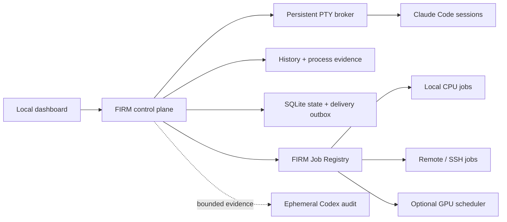

<div align="center">

# FIRM Control Room

### A local control plane for parallel AI research.

[](https://github.com/Zarien-Li/firm-control-room/actions/workflows/ci.yml)
[](https://nodejs.org/)
[](https://www.apple.com/macos/)
[](LICENSE)

**Know what every research agent is doing, what it is waiting for, and when intervention is actually justified.**

[Quick start](#quick-start) · [Job Registry](#job-registry) · [Scientific control](#scientific-control) · [中文](README.zh-CN.md)

</div>

---

Running many Claude Code sessions is easy. Keeping them scientifically coherent is not.

A terminal prompt does not tell you whether an agent has stopped, a child process is still running, a remote experiment is pending, or a message was pasted but never submitted. A quiet GPU log does not prove a job is dead. A reviewer model can detect drift and still make the research worse by oversteering it.

FIRM makes those distinctions explicit. It is a **control plane, not another research agent**.

## The three things FIRM controls

| Plane | What FIRM knows | What it prevents |
|---|---|---|
| **Research sessions** | Claude history, terminal state, process tree, artifact writes, delivery acknowledgements | false stops, duplicate continuation, unsent drafts, lost sessions |
| **Long-running jobs** | durable job identity and lifecycle across GPU, CPU, SSH, and local work | guessing from prose, PID reuse, stale completion replay, fake waiting |
| **Scientific boundaries** | frozen project authority plus bounded recent evidence | silent scope drift and reviewer-led method churn |

The result is a dashboard that can distinguish `MODEL_WORKING`, `TOOL_RUNNING`, `WAITING_FOR_JOB`, `WAITING_REVIEW`, and genuine input points without treating every pause as a problem.

## Why this is different

Most agent dashboards observe a terminal and offer a button to send more text. FIRM treats orchestration as a correctness problem:

- **A paste is not a delivery.** Messages move through a durable outbox and count as delivered only after their unique marker appears in Claude history.
- **A PID is not a job identity.** Registered processes are bound to PID, operating-system birth token, and argv fingerprint.
- **Silence is not failure.** A project may wait only on an independently verified, project-owned active job.
- **Utilization is not authority.** Low GPU usage is diagnostic evidence, never permission to kill a worker.
- **Review is not leadership.** Codex may detect a boundary violation, but cannot choose a method, add experiments, change contribution type, or stop a research program.
- **Uncertainty stays visible.** Ambiguous terminal, transport, process, and policy states are never silently collapsed into “working” or “stopped.”

## Quick start

### Requirements

- macOS; external iTerm discovery and control are currently macOS-specific
- Node.js 26+
- [Claude Code](https://docs.anthropic.com/en/docs/claude-code) installed and logged in
- Codex CLI only if you enable independent boundary audits

### 1. Install

```bash
git clone https://github.com/Zarien-Li/firm-control-room.git
cd firm-control-room
npm ci
```

### 2. Create a project

```bash
mkdir -p "$HOME/research"
cp -R examples/research-project "$HOME/research/project-alpha"
cp config/projects.example.json config/projects.json
```

Update `config/projects.json` and fill in the project template:

```text
~/research/project-alpha/
├── CLAUDE.md
├── CLAUDE-RESEARCH.md
├── PROGRAM_ORIGIN.md
├── PROJECT_IDENTITY.json
├── SEED.md
├── PIPELINE_STATE.md
└── prompt.txt
```

These files separate durable authority from mutable session narration. FIRM reads a small allowlist; it does not recursively ingest the research repository.

### 3. Verify and start

```bash
npm run doctor
npm start
```

Open [http://127.0.0.1:8787](http://127.0.0.1:8787). Start a managed Claude session from the dashboard, or keep using Claude Code in iTerm inside a configured project and let FIRM discover it.

To run only the operational control plane:

```bash
FIRM_CODEX_AUDIT_ENABLED=false npm start
```

## How it works



The PTY broker outlives the browser and web process. Session state is reconstructed from four independent signals: terminal surface, main-chain Claude history, descendant tool processes, and bounded artifact writes. The Job Registry separately owns long-task truth.

## Job Registry

Every long-running GPU, CPU, SSH, or local task receives one durable `runId` and one explicit lifecycle:

```text
pending → running → done | failed | cancelled
```

Unknown liveness is metadata. It never rewrites the authoritative lifecycle.

### Register non-GPU work

```bash
scripts/run-registered-job.sh RUN_ID PROJECT_ID local_cpu -- command arg...
scripts/run-registered-job.sh RUN_ID PROJECT_ID remote_cpu -- ssh host command...
scripts/run-registered-job.sh RUN_ID PROJECT_ID ssh -- ssh host command...
```

The API exposes:

```text
GET  /api/jobs
POST /api/jobs
POST /api/jobs/:runId/status
```

`GET /api/jobs` returns active jobs plus recent terminal jobs by default. Full terminal history is cursor-paginated with `?view=history&limit=25&cursor=...`, so the live API does not grow without bound.

A Claude session may declare a legitimate wait only with:

```text
[FIRM WAITING_FOR_JOB run_id=<run_id>]
```

FIRM accepts it only when the Registry independently shows the same project-owned job as `pending` or `running`. Missing, completed, failed, cancelled, cross-project, and merely planned work cannot suppress liveness handling.

### Optional GPU adapter

The public build runs with GPU integration disabled. To connect an SSH-accessible scheduler:

```bash
export FIRM_GPU_QUEUE_ENABLED=true
export FIRM_GPU_SCHEDULER_AUTO_START=true
export FIRM_GPU_QUEUE_HOST=user@gpu-control-host
export FIRM_GPU_QUEUE_SSH_PORT=22
export FIRM_GPU_QUEUE_DOCKER_CONTAINER=research-container
export FIRM_GPU_QUEUE_ROOT=/absolute/remote/path/to/gpu_queue
export FIRM_GPU_PROJECT_ROOT=/absolute/remote/path/to/projects
npm start
```

The adapter imports this lifecycle into the Registry:

```text
pending/.submitted → running/.started → done|failed|cancelled/.ready
```

FIRM observes the queue through a fixed SSH collector. Your scheduler remains the sole owner of worker launch and termination.

## Scientific control

FIRM keeps operational management separate from scientific judgment.

### Project Claude remains the lead PI

Routine interpretation, method design, experiments, and claims stay inside the project session. Generic Goal Loop injection is globally disabled by default. Ordinary menus can be resolved, while permissions and genuinely human-owned choices remain untouched.

### Codex is a bounded auditor

When enabled, Codex runs as a short-lived, read-only process over an authority-first evidence packet. It may flag identity, scope, evidence, compute, or operational drift. It may not invent the next method, add a baseline, raise the acceptance bar, change the paper identity, or issue stop/freeze/retire decisions.

If another scheduler owns portfolio-level scientific review, disable FIRM's periodic audit:

```bash
FIRM_SCAN_INTERVAL_MS=0 FIRM_CODEX_AUDIT_ENABLED=false npm start
```

FIRM then remains responsible for sessions, delivery, Job Registry state, and operational recovery only.

## Configuration

Start from [.env.example](.env.example). Export variables through your shell or process manager; FIRM does not automatically load `.env` files.

| Variable | Default | Purpose |
|---|---:|---|
| `RESEARCH_PROJECT_ROOT` | `~/research` | Root used by project configuration |
| `FIRM_CONFIG` | `config/projects.json` | Project configuration file |
| `FIRM_HOST` | `127.0.0.1` | Local bind address |
| `FIRM_PORT` | `8787` | Dashboard port |
| `FIRM_CODEX_AUDIT_ENABLED` | `true` | Enable bounded Codex audits |
| `FIRM_SCAN_INTERVAL_MS` | `9000000` | Periodic audit interval; `0` disables it |
| `FIRM_REANCHOR_MODE` | `approval` | `off`, `approval`, or `auto` |
| `FIRM_GOAL_LOOP_ENABLED` | `false` | Global switch for generic continuation |
| `FIRM_GOAL_MAX_CONTINUES_PER_DAY` | `48` | Rolling per-project continuation limit |
| `FIRM_GPU_QUEUE_ENABLED` | `false` | Enable the optional GPU adapter |
| `FIRM_GPU_SCHEDULER_AUTO_START` | `false` | Start a configured scheduler for new requests |
| `FIRM_DATA_DIR` | `./var` | Runtime database, evidence, and transcripts |

See [src/config.js](src/config.js) for bounded timing and executable overrides.

## Verification

```bash
npm run check
npm run check:jobs
npm test
npm run smoke
npm run acceptance:restart
```

The current suite contains **142 tests** covering broker/web restarts, delayed acknowledgements, interrupted sends, unsent drafts, PID reuse, paginated job history, valid job waits, stale event replay, terminal noise, process ambiguity, GPU monitor loss, and duplicate-delivery prevention.

## Security and limits

- FIRM binds to localhost by default and has no multi-user authentication. Do not expose it directly to a network.
- Project collection is read-only and allowlisted; runtime state stays under `var/`.
- Web APIs use configured projects, fixed executables, fixed arguments, and fixed working directories.
- Codex receives project/session text as untrusted evidence and runs read-only.
- Queue free text is never injected directly into a research session.
- Only an explicit user action may normally terminate a Claude session.
- `var/`, `work/`, local project configuration, logs, and environment files are excluded from Git.

FIRM is an early open-source release extracted from a real multi-project research workflow. It favors explicit uncertainty over confident automation built on guessed state.

## License

[MIT](LICENSE)
