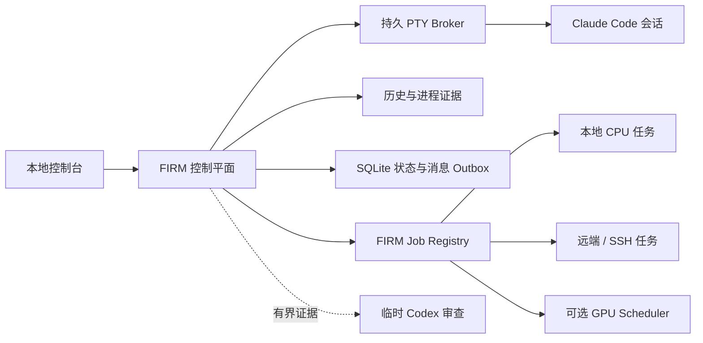

<div align="center">

# FIRM Control Room

### 面向并行 AI 研究的本地控制平面

[](https://github.com/Zarien-Li/firm-control-room/actions/workflows/ci.yml)
[](https://nodejs.org/)
[](https://www.apple.com/macos/)
[](LICENSE)

**知道每个研究 Agent 正在做什么、在等什么，以及什么时候才真的需要干预。**

[五分钟启动](#五分钟启动) · [任务注册表](#firm-job-registry) · [科学控制](#科学控制) · [English](README.md)

</div>

---

多开几个 Claude Code 终端很容易，困难的是让它们长期并行研究而不失去控制。

看到输入框，不代表 Claude 真的停了；安静的日志，不代表远端实验已经死亡；文字被粘贴进终端，也不代表它按下了回车；Codex 能发现偏移，也可能因为过度审查反过来带偏主 PI。

FIRM 把这些状态明确分开。它是**研究控制平面，不是又一个研究 Agent**。

## FIRM 管理的三层事实

| 层面 | FIRM 使用的证据 | 避免的问题 |
|---|---|---|
| **研究会话** | Claude 历史、终端、进程树、产物写入、消息 ACK | 假停顿、重复续写、未发送草稿、会话丢失 |
| **长任务** | GPU、CPU、SSH 和本地任务的持久身份与生命周期 | 从自然语言猜状态、PID 复用、过期完成通知、虚假等待 |
| **科学边界** | 冻结的项目权威文件与有界近期证据 | 研究范围静默漂移、审查模型接管方法路线 |

因此，FIRM 可以区分 `MODEL_WORKING`、`TOOL_RUNNING`、`WAITING_FOR_JOB`、`WAITING_REVIEW` 和真正的输入点，而不是把每次暂停都当成故障。

## 为什么它不是普通 Agent Dashboard

- **粘贴不等于送达。** 消息必须经过持久 outbox，并在 Claude 历史里出现唯一 marker 才算完成。
- **PID 不等于任务身份。** 进程同时绑定 PID、操作系统启动时间和 argv 指纹，防止 PID 复用或错误关联。
- **安静不等于失败。** 只有 Registry 独立确认的同项目活跃任务，才能让研究会话合法等待。
- **利用率不等于操作权限。** GPU 利用率低只是诊断信号，不能授权停止 worker。
- **审查不等于领导。** Codex 可以发现边界偏移，但不能选择方法、追加实验、改变论文类型或关闭研究方向。
- **不确定性不会被藏起来。** 模糊终端、传输、进程和策略状态会保留为独立状态，不会伪装成“正常”。

## 五分钟启动

### 环境要求

- macOS；外部 iTerm 发现与控制目前依赖 macOS
- Node.js 26+
- 已安装并登录 Claude Code
- 只有启用独立边界审查时才需要 Codex CLI

### 1. 安装

```bash
git clone https://github.com/Zarien-Li/firm-control-room.git
cd firm-control-room
npm ci
```

### 2. 建立项目

```bash
mkdir -p "$HOME/research"
cp -R examples/research-project "$HOME/research/project-alpha"
cp config/projects.example.json config/projects.json
```

修改 `config/projects.json`，并填写项目模板：

```text
~/research/project-alpha/
├── CLAUDE.md
├── CLAUDE-RESEARCH.md
├── PROGRAM_ORIGIN.md
├── PROJECT_IDENTITY.json
├── SEED.md
├── PIPELINE_STATE.md
└── prompt.txt
```

这些文件把长期研究权威与会话临时叙事分离。FIRM 只读取小型白名单，不会递归吞入整个研究仓库。

### 3. 自检并启动

```bash
npm run doctor
npm start
```

打开 [http://127.0.0.1:8787](http://127.0.0.1:8787)。可以在网页中启动托管 Claude，也可以继续使用配置目录中的现有 iTerm Claude 会话，由 FIRM 自动发现。

只启用运行管理，不使用 Codex 审查：

```bash
FIRM_CODEX_AUDIT_ENABLED=false npm start
```

## 系统结构



PTY Broker 独立于浏览器和 Web 进程存活。会话状态由终端表面、Claude 主链历史、子工具进程和白名单产物写入共同确认；长任务事实则由 Job Registry 单独负责。

## FIRM Job Registry

每个 GPU、CPU、SSH 或本地长任务都有一个持久 `runId` 和唯一生命周期：

```text
pending → running → done | failed | cancelled
```

“暂时看不见进程”只是可观测性元数据，不能擅自改变任务生命周期。

### 注册非 GPU 任务

```bash
scripts/run-registered-job.sh RUN_ID PROJECT_ID local_cpu -- command arg...
scripts/run-registered-job.sh RUN_ID PROJECT_ID remote_cpu -- ssh host command...
scripts/run-registered-job.sh RUN_ID PROJECT_ID ssh -- ssh host command...
```

API：

```text
GET  /api/jobs
POST /api/jobs
POST /api/jobs/:runId/status
```

默认查询只返回所有活跃任务和最近完成的任务。完整历史使用 `?view=history&limit=25&cursor=...` 游标分页，避免项目长期运行后 API 无限膨胀。

Claude 只有输出以下唯一机器标记时，才可能进入合法等待：

```text
[FIRM WAITING_FOR_JOB run_id=<run_id>]
```

FIRM 还会独立确认 Registry 中同项目、同 run ID 确实处于 `pending` 或 `running`。缺失、完成、失败、取消、跨项目和仅计划中的任务都不能压制会话恢复逻辑。

### 可选 GPU 接入

公开版默认关闭 GPU 集成。接入自己的 SSH Scheduler：

```bash
export FIRM_GPU_QUEUE_ENABLED=true
export FIRM_GPU_SCHEDULER_AUTO_START=true
export FIRM_GPU_QUEUE_HOST=user@gpu-control-host
export FIRM_GPU_QUEUE_SSH_PORT=22
export FIRM_GPU_QUEUE_DOCKER_CONTAINER=research-container
export FIRM_GPU_QUEUE_ROOT=/absolute/remote/path/to/gpu_queue
export FIRM_GPU_PROJECT_ROOT=/absolute/remote/path/to/projects
npm start
```

GPU Adapter 会把以下状态同步进 Registry：

```text
pending/.submitted → running/.started → done|failed|cancelled/.ready
```

FIRM 只通过固定 SSH Collector 观察队列；worker 的启动和终止始终由你的 Scheduler 独占。

## 科学控制

### 项目 Claude 仍是主 PI

日常解释、方法设计、实验和主张由项目会话负责。通用 Goal Loop 默认全局关闭；系统可以处理普通菜单，但权限确认和真正属于用户的决定不会被代答。

### Codex 只是有边界的审查器

启用时，Codex 以短生命周期、只读进程读取“项目权威优先”的有界证据包。它可以指出 identity、scope、evidence、compute 或 operation drift，但不能发明下一方法、追加 baseline、提高验收门槛、改变论文身份或发布 stop/freeze/retire 结论。

若已有外部系统负责组合级科学审查，可以关闭 FIRM 的周期审查：

```bash
FIRM_SCAN_INTERVAL_MS=0 FIRM_CODEX_AUDIT_ENABLED=false npm start
```

此时 FIRM 只管理会话、消息投递、Job Registry 和运行故障恢复。

## 验证

```bash
npm run check
npm run check:jobs
npm test
npm run smoke
npm run acceptance:restart
```

当前 **142 项测试**覆盖 Web/Broker 重启、延迟 ACK、未发送草稿、发送中断、PID 复用、任务历史分页、合法任务等待、历史事件重放、终端噪声、进程歧义、GPU monitor 丢失和重复消息防护。

## 安全与限制

- 默认只监听 `127.0.0.1`，没有多用户认证，不要直接暴露到公网；
- 项目采集只读且有固定白名单，运行数据保存在 `var/`；
- Web API 只能使用已配置项目、固定程序、固定参数和固定工作目录；
- Codex 只读运行，项目和 session 文本一律视为不可信证据；
- Queue 中的自由文本不会直接注入研究会话；
- 正常情况下只有用户显式操作才能终止 Claude 会话；
- `var/`、`work/`、本地项目配置、日志和环境文件不会进入 Git。

FIRM 是从真实多项目研究工作流中提取出的早期开源版本。它宁可明确报告“不确定”，也不在猜测的状态上构建自信的自动化。

## 许可证

[MIT](LICENSE)
